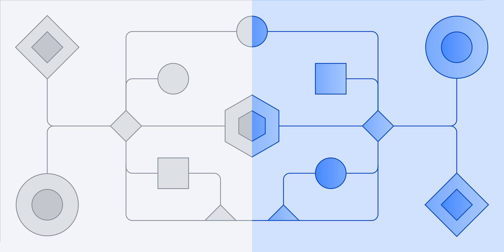

<picture>
  <source media="(prefers-color-scheme: dark)" srcset="./docs/assets/banner-dark.svg">
  
</picture>

# @carbon/element-styles

`@carbon/element-styles` is an experimental styling system for native HTML elements, relying on semantic, attribute-focused selectors instead of class names. There is no 1:1 parity between Carbon element styles and the core React and Web Component implementations of the Carbon Design System. It's use case is targeted more towards simple web pages and editorial content such as styling markdown documents.

## Getting started

### Installation

```console
npm i @carbon/element-styles
```

#### CDN

You can also use any of the [prebuilt stylesheets](#using-prebuilts) via our CDN:

```html
<!-- specific version (recommended) -->
<link rel="stylesheet" href="https://1.www.s81c.com/common/carbon/element-styles/version/v[x.y.z]/prebuilt/expressive.css" />

<!-- "latest" tag -->
<link rel="stylesheet" href="https://1.www.s81c.com/common/carbon/element-styles/tag/v0/latest/prebuilt/expressive.css" />

<!-- "next" tag -->
<link rel="stylesheet" href="https://1.www.s81c.com/common/carbon/element-styles/tag/v0/next/prebuilt/expressive.css" />
```

### Importing individual elements

To make use of individual elements, import them via `@use` and include their `styles` mixin in your Sass stylesheets:

```scss
@use '@carbon/element-styles/scss/elements/button';

@include button.styles;
```

#### Emitting on custom selectors

Every element has a default selector on which it's styles are emitted. You can configure this selector, but need to make sure the underlying HTML tag and semantics are kept.

The `button` element for example expects to be emitted on a `<button>` tag. By default, it's selector is simply `button`. If you only want to emit these styles on buttons that are explicitly of type button, you can do so via the `with` syntax of Sass or each time you include the mixin.

```scss
@use '@carbon/element-styles/scss/elements/button' with ($config: (
  selector: 'button[type="button"]',
));

@include button.styles;
```

```scss
@use '@carbon/element-styles/scss/elements/button';

@include button.styles((
  selector: 'button[type="button"]',
));
```

#### Configuring elements

Some elements have additional configuration options to adjust their visual appearance. You can configure these options the same way as you can configure the selector: via the `with` syntax of Sass or each time you include the mixin:

```scss
@use '@carbon/element-styles/scss/elements/button' with ($config: (
  kind: 'ghost',
));

@include button.styles;
```

```scss
@use '@carbon/element-styles/scss/elements/button';

@include button.styles((
  kind: 'ghost',
));
```

Combining these options with custom selectors means you can emit multiple variants of the same element depending on their context:

```scss
@use '@carbon/element-styles/scss/elements/button';

@include button.styles;
@include button.styles((
  selector: 'button[type="submit"]',
  kind: 'primary',
));
```

### Using prebuilts

This library offers several prebuilt (opinionated) stylesheets you can use out-of-the-box:

#### Productive

Includes all available elements with their default selectors. Uses a productive style with medium sized elements. Intended for interaction-heavy pages.

<table>
  <tbody>
    <tr>
      <th>SCSS</th>
      <td><code>/scss/prebuilt/productive.scss</code></td>
    </tr>
    <tr>
      <th>CSS</th>
      <td><code>/css/prebuilt/productive.css</code></td>
    </tr>
    <tr>
      <th>CDN</th>
      <td>https://1.www.s81c.com/common/carbon/element-styles/tag/v0/latest/prebuilt/productive.css</td>
    </tr>
  </tbody>
</table>

#### Expressive

Includes all available elements with their default selectors. Uses an expressive style with large sized elements. Intended for content-heavy pages such as marketing or documentation.

<table>
  <tbody>
    <tr>
      <th>SCSS</th>
      <td><code>/scss/prebuilt/expressive.scss</code></td>
    </tr>
    <tr>
      <th>CSS</th>
      <td><code>/css/prebuilt/expressive.css</code></td>
    </tr>
    <tr>
      <th>CDN</th>
      <td>https://1.www.s81c.com/common/carbon/element-styles/tag/v0/latest/prebuilt/expressive.css</td>
    </tr>
  </tbody>
</table>

#### Editorial

Only includes non-interactive elements with their default selectors. Uses an expressive style with large elements. Intended for content-only pages such as blogs and styling raw markdown.

<table>
  <tbody>
    <tr>
      <th>SCSS</th>
      <td><code>/scss/prebuilt/editorial.scss</code></td>
    </tr>
    <tr>
      <th>CSS</th>
      <td><code>/css/prebuilt/editorial.css</code></td>
    </tr>
    <tr>
      <th>CDN</th>
      <td>https://1.www.s81c.com/common/carbon/element-styles/tag/v0/latest/prebuilt/editorial.css</td>
    </tr>
  </tbody>
</table>

## Emit Carbon tokens

`@carbon/element-styles` relies on the tokens defined by `@carbon/styles`. Therefore, it's not meant to be used standalone but in a container that has emitted a Carbon theme.

**Important**: in order for button styles to work, you must emit the Carbon's component tokens for buttons. If you're using `@carbon/styles` that's likely already the case. For convenience, this library also provides an `emit-carbon-tokens` mixin which includes the necessary component tokens.

```scss
@use '@carbon/element-styles';

:root {
  @include element-styles.emit-carbon-tokens('white');
}
```

To also generate CSS custom properties of all available colors, use the `emit-carbon-colors` mixin:

```scss
@use '@carbon/element-styles';

:root {
  @include element-styles.emit-carbon-colors;
}

/**
 * ↪ :root {
 *     --cds-black-100: #000000;
 *     --cds-blue-10: #edf5ff;
 *     --cds-blue-20: #d0e2ff;
 *     …
 *   }
 */
```

## Configure layout options

All elements are built on contextual layout tokens that define properties like size and density. You can specify these layout tokens for individual parts of your page.

<details>
<summary>Density</summary>

### Density

Controls the density of elements, mostly through inline padding.

#### Supported values

- `condensed`
- `normal` (default)

#### Emitted tokens

- `$density--padding`

#### Example

```scss
@use '@carbon/element-styles/scss/layout';

:root {
  @include layout.density('condensed');
}

.callout {
  padding: layout.$density--padding;
}
```

</details>

<details>
<summary>Mode</summary>

### Mode

Controls the overall visual impression through font sizes and spacings.

#### Supported values

- `productive` (default)
- `expressive`

#### Emitted tokens

- `$mode--max-inline-size`
- `$mode--margin-block`
- `$mode--transition-duration`
- `$mode--transition-timing-function`

#### Available mixins

- `mode--body`
- `mode--body-compact`
- `mode--heading`
- `mode--heading-compact`
- `mode--label`
- `mode--helper-text`
- `mode--code`
- `mode--quotation`
- `mode--heading-level-1`
- `mode--heading-level-2`
- `mode--heading-level-3`
- `mode--heading-level-4`
- `mode--heading-level-5`
- `mode--heading-level-6`

#### Example

```scss
@use '@carbon/element-styles/scss/layout';

:root {
  @include layout.mode('expressive');
}

.callout {
  margin-block: layout.$mode--margin-block;
}

.callout header {
  @include layout.mode--heading-compact;
}
```

</details>

<details>
<summary>Size</summary>

### Size

Controls the height of elements.

#### Supported values

- `xs`
- `sm`
- `md` (default)
- `lg`
- `xl`

#### Emitted tokens

- `$size--block-size`
- `$size--padding-block-start`
- `$size--padding-block-end`

#### Example

```scss
@use '@carbon/element-styles/scss/layout';

:root {
  @include layout.size('lg');
}

.callout header {
  block-size: layout.$size--block-size;
}
```

</details>

## Guiding principles

### 1. Platform proximity

The goal of this library is to provide opinionated styles for native HTML elements and ARIA patterns. Several components from the core Carbon libraries are intentionally missing from this project due to a lack of matching native counterparts. The intent is to not rely on class names or special attributes.

However, there is one exception to this: the tile element. Tiles are one of the most fundamental and widely used components in Carbon. The default selector for tile styles is `[data-tile]`.


### 2. Logical layouts

Layout decisions that should be consistent across multiple elements are not the responsibility of those elements. Rather, their parent layout (page or zone) should control aspects like the size, density, and overall apperance.

### 3. Feature foresight

Not every element in this library is fully compatible with all major browsers yet. This project intentionally uses some of the latest features available to some browsers in order to validate whether they are suitable to support current and upcoming concepts of the Carbon Design System.

## License

Licensed under the [Apache 2.0](./LICENSE) license.

## <picture><source height="20" width="20" media="(prefers-color-scheme: dark)" srcset="https://raw.githubusercontent.com/ibm-telemetry/telemetry-js/main/docs/images/ibm-telemetry-dark.svg"><source height="20" width="20" media="(prefers-color-scheme: light)" srcset="https://raw.githubusercontent.com/ibm-telemetry/telemetry-js/main/docs/images/ibm-telemetry-light.svg"></picture> IBM Telemetry

This package uses IBM Telemetry to collect de-identified and anonymized metrics
data. By installing this package as a dependency you are agreeing to telemetry
collection. To opt out, see
[Opting out of IBM Telemetry data collection](https://github.com/ibm-telemetry/telemetry-js/tree/main#opting-out-of-ibm-telemetry-data-collection).
For more information on the data being collected, please see the
[IBM Telemetry documentation](https://github.com/ibm-telemetry/telemetry-js/tree/main#ibm-telemetry-collection-basics).
